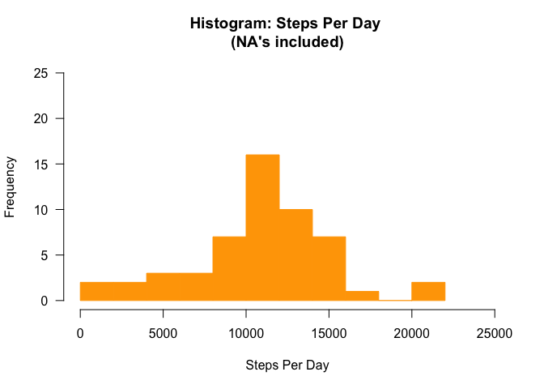
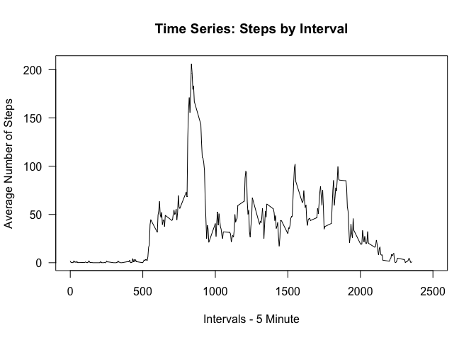
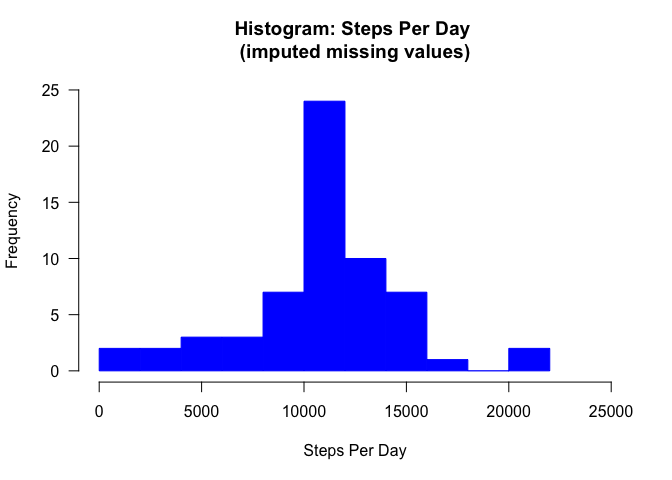
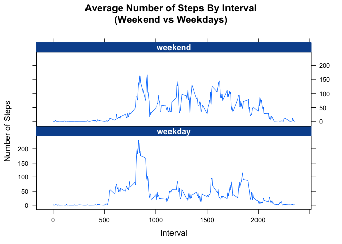

# Reproducible Research: Peer Assessment 1
Anthony Bateman  
Nov. 14, 2015  

##Loading and preprocessing the data.

```r
echo = TRUE
suppressMessages(library(knitr))
if (!file.exists("activity.csv")) {
  unzip ("activity.zip", exdir = "./")
}
data <-
  read.csv(
    "activity.csv", header = TRUE,sep = ",", na.strings = "NA", stringsAsFactors = FALSE
  )
data$date <- as.Date(data$date, "%Y-%m-%d")
```

##What is mean total number of steps taken per day?


```r
suppressMessages(library(dplyr))
echo = TRUE
stepsPreDay <- data %>%
  group_by(date) %>%
  summarise(
    total = sum(steps), meanVal = mean(steps,rm.na = TRUE), medianVal =  median(steps)
  )
```

####Make a histogram of the total number of steps taken each day.


```r
echo = TRUE
hist(
  stepsPreDay$total,
  main = "Histogram: Steps Per Day \n(NA's included)",
  xlab = "Steps Per Day",
  las = 1,col = "orange",
  border = "orange",
  breaks = 8,
  xlim = c(0,25000),
  ylim = c(0,25)
)
```

 

####Calculate and report the mean and median of the total number of steps taken per day.


```r
echo = TRUE
suppressMessages(library(data.table))
meanTotalStepPerDay <- mean(stepsPreDay$total,na.rm = TRUE)
medianTotalStepsPerDay <- median(stepsPreDay$total,na.rm = TRUE)
sumTotalStepsPerDay <- sum(stepsPreDay$total,na.rm = TRUE)

gbd <- data.table(Date = stepsPreDay$date, Total.Steps = stepsPreDay$total)
tb <- kable(gbd,caption = "Steps Per Day - Totals", format = 'markdown')
```


```r
results = 'asis'
message = FALSE 
print(tb)
```

```
## 
## 
## |Date       | Total.Steps|
## |:----------|-----------:|
## |2012-10-01 |          NA|
## |2012-10-02 |         126|
## |2012-10-03 |       11352|
## |2012-10-04 |       12116|
## |2012-10-05 |       13294|
## |2012-10-06 |       15420|
## |2012-10-07 |       11015|
## |2012-10-08 |          NA|
## |2012-10-09 |       12811|
## |2012-10-10 |        9900|
## |2012-10-11 |       10304|
## |2012-10-12 |       17382|
## |2012-10-13 |       12426|
## |2012-10-14 |       15098|
## |2012-10-15 |       10139|
## |2012-10-16 |       15084|
## |2012-10-17 |       13452|
## |2012-10-18 |       10056|
## |2012-10-19 |       11829|
## |2012-10-20 |       10395|
## |2012-10-21 |        8821|
## |2012-10-22 |       13460|
## |2012-10-23 |        8918|
## |2012-10-24 |        8355|
## |2012-10-25 |        2492|
## |2012-10-26 |        6778|
## |2012-10-27 |       10119|
## |2012-10-28 |       11458|
## |2012-10-29 |        5018|
## |2012-10-30 |        9819|
## |2012-10-31 |       15414|
## |2012-11-01 |          NA|
## |2012-11-02 |       10600|
## |2012-11-03 |       10571|
## |2012-11-04 |          NA|
## |2012-11-05 |       10439|
## |2012-11-06 |        8334|
## |2012-11-07 |       12883|
## |2012-11-08 |        3219|
## |2012-11-09 |          NA|
## |2012-11-10 |          NA|
## |2012-11-11 |       12608|
## |2012-11-12 |       10765|
## |2012-11-13 |        7336|
## |2012-11-14 |          NA|
## |2012-11-15 |          41|
## |2012-11-16 |        5441|
## |2012-11-17 |       14339|
## |2012-11-18 |       15110|
## |2012-11-19 |        8841|
## |2012-11-20 |        4472|
## |2012-11-21 |       12787|
## |2012-11-22 |       20427|
## |2012-11-23 |       21194|
## |2012-11-24 |       14478|
## |2012-11-25 |       11834|
## |2012-11-26 |       11162|
## |2012-11-27 |       13646|
## |2012-11-28 |       10183|
## |2012-11-29 |        7047|
## |2012-11-30 |          NA|
```

#####Mean Total Steps Per Day


```r
echo = TRUE
print(meanTotalStepPerDay)
```

```
## [1] 10766.19
```

#####Median Total Steps per Day


```r
echo = TRUE
print(medianTotalStepsPerDay)
```

```
## [1] 10765
```

##What is the average daily activity pattern?
####Make a time series plot...


```r
echo = TRUE
aggdata <- aggregate(steps ~ interval, data, mean)
plot(
  aggdata,
  type = 'l',
  main = "Time Series: Steps by Interval",
  xlab = "Intervals - 5 Minute",
  ylab = "Average Number of Steps",
  las = 1,
  xlim = c(0,2500)
)
```

 

####Which 5-minute interval, on average across all the days in the dataset, contains the maximum number of steps?


```r
echo = TRUE
print(aggdata[which.max(aggdata$steps),])
```

```
##     interval    steps
## 104      835 206.1698
```

##Imputing missing values

####Calculate and report the total number of missing values in the dataset.

#####Total Number of Missing Values (NA)


```r
echo = TRUE
print(sum(is.na(data)))
```

```
## [1] 2304
```

####Devise a strategy for filling in all of the missing values...

**Missing values (NA) are imputed by calculating the mean for aggregated Interval values.**

####
####Create a new dataset that includes imputed missing values.


```r
# This is sort of slow, but I couldn't figure out a fancier way, Sorry.
echo = TRUE
if (!exists("dataImp")) {
  dataImp <- data
  ct <- nrow(dataImp)
  for (i in 1:ct) {
    if (is.na(dataImp$steps[i])) {
      t = filter(aggdata, dataImp$interval[i] == aggdata$interval)
      tt = t[2]
      dataImp$stepsImp[i] = as.numeric(tt)
    }
    else
      dataImp$stepsImp[i] =  as.numeric(dataImp$steps[i])
  }
  #drop the unimputed steps col, juggle and rename to match the originaal data set.
  dataImp <- subset(dataImp, select = -c(steps))
  dataImp <- dataImp[,c(3,1,2)]
  names(dataImp)[names(dataImp) == 'stepsImp'] <- 'steps'
}
```

####Make a histogram of the total number of steps taken each day.


```r
echo=TRUE
stepsPreDayImp <- dataImp %>%
  group_by(date) %>%
  summarise(
    total = sum(steps),
    meanVal = mean(steps,rm.na = TRUE),
    medianVal =  median(steps)
  )

hist(
  stepsPreDayImp$total,
  main = "Histogram: Steps Per Day \n(imputed missing values)",
  xlab = "Steps Per Day",
  las = 1,
  col = "blue",
  border = "blue",
  breaks = 8,
  xlim = c(0,25000),
  ylim = c(0,25)
)
```

 

####Calculate and report the mean and median total number of steps taken per day.


```r
echo=TRUE
meanTotalStepPerDayImp <- mean(stepsPreDayImp$total,na.rm = TRUE)
medianTotalStepsPerDayImp <- median(stepsPreDayImp$total,na.rm = TRUE)
sumTotalStepsPerDayImp <- sum(stepsPreDayImp$total,na.rm = TRUE)
```

#####Mean - Total Steps Per Day (imputed missing values)

```r
echo=TRUE
print(meanTotalStepPerDayImp)
```

```
## [1] 10766.19
```
#####Median - Total Steps per Day (imputed missing values)

```r
echo=TRUE
print(medianTotalStepsPerDayImp)
```

```
## [1] 10766.19
```

##Are there differences in activity patterns between weekdays and weekends?

####Create a new factor variable in the dataset with two levels – "weekday" and "weekend".

```r
echo = TRUE
weekdayT <- weekdays(dataImp$date,abbreviate = FALSE)
weekdayList <- c("Monday","Tuesday","Wednesday","Thursday","Friday")
dataImp$dayType <- as.factor(ifelse(weekdayT %in% weekdayList,"weekday","weekend"))

meanStepsPerDayByIntervalImp <- 
  dataImp %>% 
  group_by(dayType,interval) %>% 
  summarise(meanStepVal = mean(steps,rm.na = TRUE))
```

####Make a panel plot containing a time series plot...

*the average number of steps taken, averaged across all weekday days or weekend days.*


```r
suppressMessages(library(lattice))
suppressMessages(library(RColorBrewer))
colorsTheme <- brewer.pal(6,"Blues")
my.theme <- list(
  superpose.polygon = list(col = colorsTheme[2:5], border = "transparent"),
  strip.background = list(col = colorsTheme[6]),
  strip.border = list(col = colorsTheme[6]))

plotd <-
  xyplot(
    meanStepsPerDayByIntervalImp$meanStepVal ~ meanStepsPerDayByIntervalImp$interval | meanStepsPerDayByIntervalImp$dayType,
    type = "l",
    main = "Average Number of Steps By Interval\n(Weekend vs Weekdays)",
    ylab = "Number of Steps",
    xlab = "Interval",
    par.settings = my.theme,
    par.strip.text = list(col = "white", font = 2),
    layout = (c(1,2))
  )
print(plotd)
```

 

#####(cont.) *Are there differences in activity patterns between weekdays and weekends?*

Yes, in general a higher level of activity is observed on weekends, particularly in the intervals between 1000 and 2000.
Visual inspection of the plot (Average Number of Steps By Interval) indicates that weekend activity is more consistent throughout the day.

Weekend and weekday plots each show a peek in activity between intervals 750 and 1000. The peek is more pronounced on weekdays - perhaps reflecting activity related to going to work or school? A decrease in activity on weekdays between the 1000 and 2000 interval is observered.

An increase in activity is observed on weekdays in the interval between 500 and 750 - a time period of approx. 2 hours, suggesting that people wake up much earlier on weekday.
